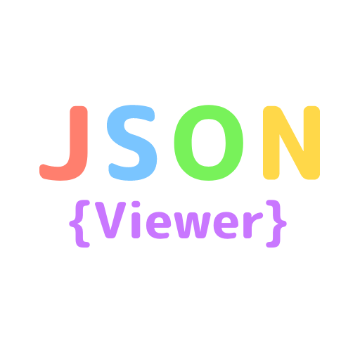
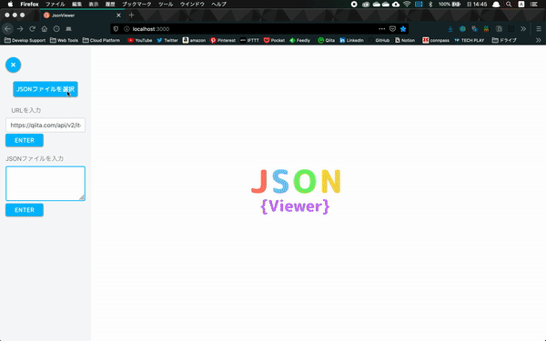

# JsonViewer
## Build Setup

```bash
# install dependencies
$ npm install

# serve with hot reload at localhost:3000
$ npm run dev

# build for production and launch server
$ npm run build
$ npm run start

# generate static project
$ npm run generate
```

## Site Link
↓ click under image<br>
<a href="https://cyan-namid09-jsonviewer.firebaseapp.com/">
  
</a>

## About
This site is the viewer for json files.

You can see a preview of the json file in the following ways.
* Select a file
* Enter json format text data

## Preview
